# 8086 汇编

## 基础知识

前往 bilibili 观看小甲鱼课程: <https://www.bilibili.com/video/BV1Rs411c7HG>

### 计算机组成 (8086PC)

计算机由 CPU, 内存, 硬盘, 显卡, 网卡, 声卡, 主板 等构成  
主板作为整体骨架连接各个器件  
其它设备则连接至主板, 如键盘通过 USB 接口连接主板

### CPU

CPU 是计算机的核心部件, 它控制整个计算机的运作并进行运算, 想要让一个 CPU 工作, 就必须向它提供指令和数据

指令和数据在存储器中存放, 也就是平时所说的内存

#### 指令和数据

指令和数据是应用上的概念, 在内存或磁盘上, 指令和数据没有区别, 都是二进制数据  
**在汇编中十六进制的数据以H结尾, 二进制数据以B结尾, 八进制数据以O结尾, 十进制数据以D结尾, 默认为十进制**

例如:

```text
二进制信息:
1000100111011000
-> 89D8H (数据)
1000100111011000
-> mov ax,bx (指令)
```

#### CPU 组成

CPU 由 运算器, 控制器, 寄存器 等组成  
CPU 内部器件通过内部总线连接, 通过外部总线与外部器件连接

### 存储单元

存储器被分为诺干个存储单元, 每个存储单元从 0 开始顺序编号
一个存储单元为 1Byte (1B), 一般为 8个 bit

### CPU 对存储器的读写

CPU 想要进行数据的读写, 必须和外部器件 (标准的说法是芯片) 进行三类信息交互:

- 存储单元的地址 (地址信息)
- 器件的选择, 读或写命令 (控制信息)
- 读或写的数据 (数据信息)

在计算机中专门有连接 CPU 和其它芯片的导线, 通常称为总线

### CPU 外部总线

CPU 通过三条外部总线操作器件, 分别是 地址总线, 数据总线, 控制总线  
地址总线传输内存地址, 数据总线传输数据, 控制总线传输指令, 读或者写  
例如向 AB 读取数据, 则先从地址总线传输 AB 给内存, 然后从控制总线传输 读 的指令, 最后通过数据总线接收数据  
每一个 CPU 芯片都有许多管脚, 这些管脚和总线相连, 也可以说, 这些管脚引出总线  
一个 CPU 可以引出三种总线的宽度标志了这个 CPU 不同方面的性能  
地址总线的宽度决定了 CPU 的寻址能力  
数据总线的宽度决定了 CPU 与其它器件进行数据传送时一次数据传送量  
控制总线的宽度决定了 CPU 对系统中其它器件的控制能力  
例如: 10 个地址总线的 CPU 最多能操作 1KB 大小的地址, 32 个地址总线的 CPU 最多能操作 4GB 大小的地址

CPU 外部总线与内存连接示例图:

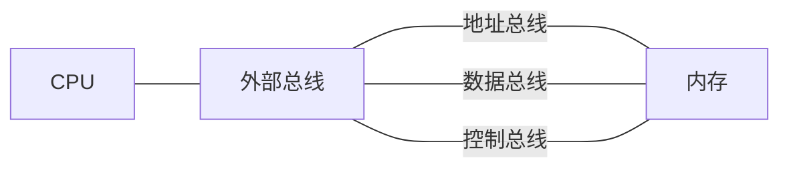

### 接口卡

计算机系统中, 所有可用程序控制其工作的设备, 必须受到 CPU 的控制  
CPU 对外部设备不能直接控制, 如显示器、音响、打印机等。直接控制这些设备进行工作的是插在扩展插槽上的接口卡

### 各类存储器芯片

从读写属性上看分为两类:  
随机存储器 (RAM) 和 只读存储器 (ROM)  
只读存储器 只能读取, 不可修改, 只能擦除

从功能和连接上分类:

- 随机存储器 RAM
- 装有 BIOS 的 ROM
- 接口卡上的 RAM

#### 装有 BIOS 的 ROM

BIOS: Basic Input/Ouput System, 基本输入输出系统

BIOS 是由主板和各类接口卡 (如: 显卡、网卡等) 厂商提供的软件系统, 可以通过它利用该硬件进行最基本的输入输出。在主板和某些接口卡上插有存储相应 BIOS 的 ROM

比如主板, 在按下开机键时第一个启动的就是主板的 BIOS, 检查 CPU, 内存 等是否插上, 启动操作系统等
比如显卡, 给显卡传输二进制图像, 显卡通过其 BIOS 内的程序运算后将图像显示到屏幕上

### PC机中各类存储器的逻辑连接情况

CPU 在最开始会索要所有器件的存储器地址, 将存储器地址按照顺序排列  
CPU 与器件内存地址连接示例图:

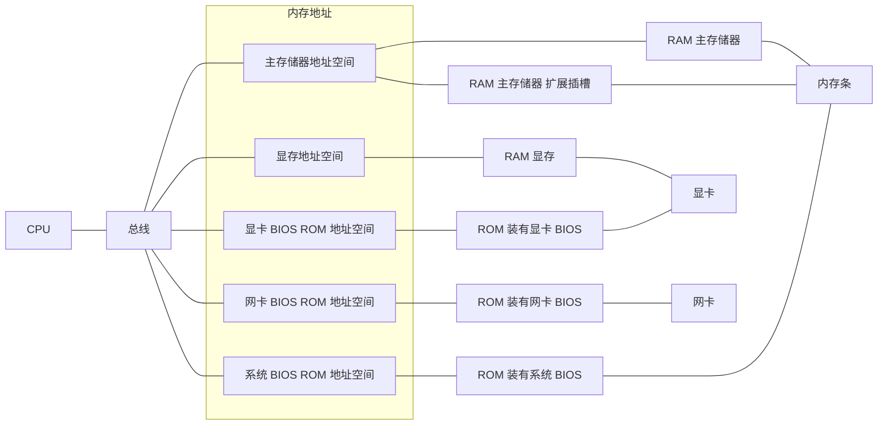

#### 8086PC 内存地址分布

内存地址从上到下顺序排列

| 地址范围 | 空间 |
| --- | --- |
| 00000 - 9FFFF | 主存储器地址空间 |
| A0000 - BFFFF | 显存地址空间 |
| C0000 - FFFFF | 各类 ROM 地址空间 |

## 汇编语言的组成

汇编语言由以下3类组成:

1. 汇编指令 (机器码的助记符)
2. 伪指令 (由编译器执行)
3. 其它符号 (由编译器识别)

CPU 能够直接识别的指令的集合称为指令集  
汇编指令是机器指令的助记符, 彤机器指令一一对应, 汇编指令会在编译时替换为二进制机器指令

## 寄存器

CPU 寄存器有 通用寄存器, 专用寄存器等, 8086CPU 拥有14个寄存器, 分别是 `AX, BX, CX, DX, SI, DI, SP, BP, IP, CS, SS, DS, ES, PSW`, 其中8个 (或4个) 为通用寄存器  
8086CPU 一个寄存器能够存放 16位 的数据 (在之前是 8位), 刚好是 2 个字节, 这 16位 则称为字 (word), **1个字等于2个字节**  
8086CPU 向下兼容, 将一个寄存器分为两个部分, 高位 (左边) 和低位 (右边), 分别8位, 例如寄存器 `AX`, 高位以 `H` 结尾, 用 `AH` 表示, 低位以 `L` 结尾, 用  `AL` 表示, 全部则用 `AX` 表示

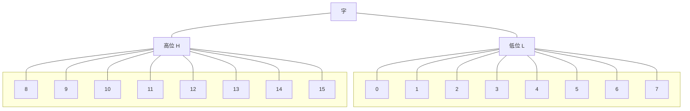

### 物理地址

CPU 访问内存单元时要给出内存单元的地址。所有的内存单元构成的存储空间是一个一维的线性空间

我们将这个唯一的地址称为物理地址

### 16位结构的 CPU

概括的讲, 16位结构描述了一个 CPU 具有以下个方面特证:

1. 运算器一次最多可以处理16位的数据
2. 寄存器的最大宽度为16位
3. 寄存器和运算器之间的通路是16位的

8086CPU 有20位的地址总线, 内部是16位的结构

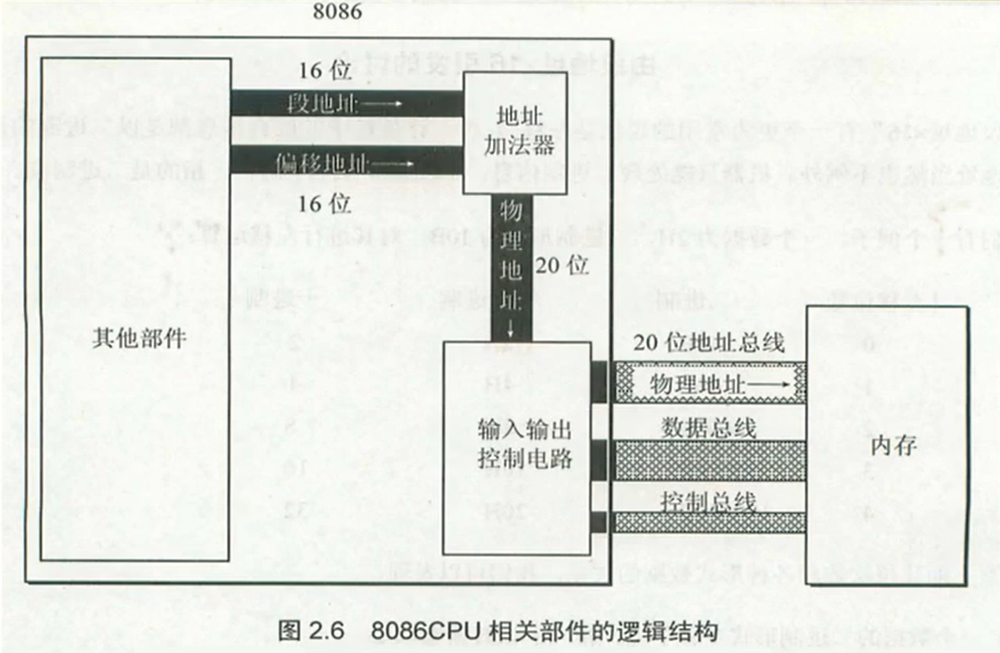

地址加法器工作原理:

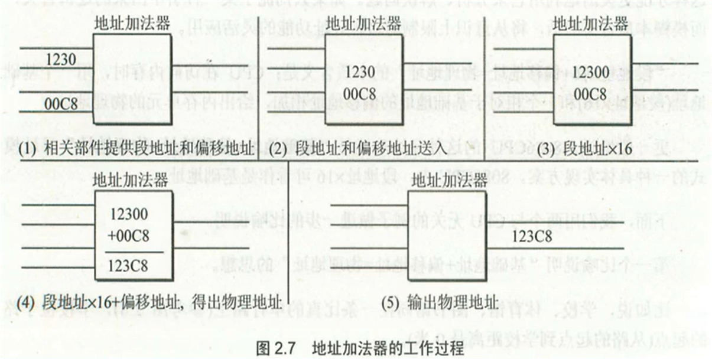

### 段的概念

错误认识:  
内存被划分成了一个一个的段, 每一个段有一个段地址

其实:
内存并没有分段, 段的划分来自于 CPU, 由于 8086CPU 用"**(段地址×16)+偏移地址=物理地址**"的方式给出内存单元的物理地址, 使得我们可以用分段的方式来管理内存

数据在 21FF60H 内存单元中, 对于 8086PC 的两种描述:

1. 数据存在内存2000:1F60单元中
2. 数据存在内存的2000段中的1F60单元中

### 段寄存器

段寄存器就是提供段地址的  
8086CPU 有4个段寄存器: `CS, DS, SS, ES`  
(Code Segment, Data Segment, Stack Segment, Extra Segment)

当 8086CPU 要访问内存时, 由这四个段寄存器提供内存单元的段地址

### CS 和 IP

CS 和 IP 是 8086CPU 中最关键的寄存器, 他指示了 CPU 当前要读取指令的地址

CS 为代码段寄存器  
IP 为指针指令寄存器

8086PC 读取和执行指令相关部件

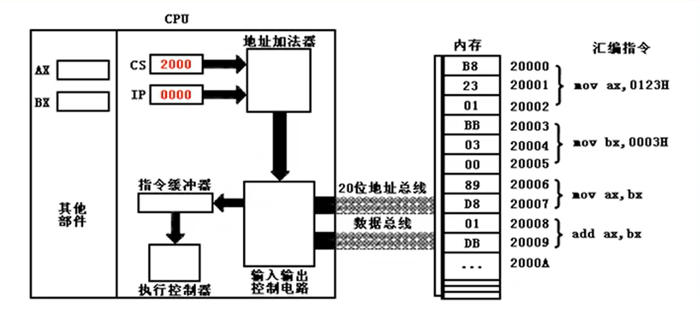

1. 从 CS:IP 指向内存单元读取指令, 读取的指令进入指令缓冲器
2. IP = IP + 所读取指令的长度, 从而指向下一条指令
3. 执行指令。转到步骤1重复这个过程

### 8086PC 工作过程的简要描述

在 8086CPU 加点启动或复位后 (即 CPU 刚开始工作时) `CS` 和 `IP` 被设置为 `CS=FFFFH`, `IP=0000H`

即在8086PC机刚启动时, CPU 从内存 `FFFF0H` 单元中读取指令执行。

`FFFF0H` 单元中的指令是8086PC机开机后执行的第一条指令

### 同时修改 CS、IP 的指令

使用 `jmp` 修改 `CS` 和 `IP` 的值

#### 同时修改 CS、IP 的内容

`jmp 段地址:偏移地址`  
`jmp 2AE3:3`  
`jmp 3:0B16`  
功能: 用指令中给出的段地址修改 CS, 偏移地址修改 IP

#### 仅修改 IP 的内容

`jmp 某一合法寄存器`  
`jmp ax` (类似于 mov IP,ax)  
`jmp bx`

功能：用寄存器中的值修改 IP

### 代码段

对于8086PC机, 在编程时, 可以根据需要, 将一组内存单元定义为一个段  
可以将长度为 N (N≤64KB) 的一组代码存在一组地址连续、起始地址为16的倍数的内存单元中, 这段内存是用来存放代码的, 从而定义了一个代码段

如何使得代码段中的指令被执行呢  
CPU 只认被 CS:IP 指向的内存单元中的内容为指令  
所以要将 CS:IP 指向所定义的代码段中的第一条指令的首地址

### DEBUG

| 命令 | 描述 | 例子 |
| --- | --- | --- |
| R | 查看、改变CPU寄存器的内容 | `r`, `r cs`, `r ip` |
| D | 查看内存中的内容 | `d`, `d fff0:0`, `d fff0:0 ff` |
| E | 改写内存中的内容 | `e b810:0`, `e b810:0 01 01 02 02 03 03 04 04` |
| U | 将内存中的机器指令翻译成汇编指令 | `u` |
| T | 执行一条机器指令 | `t` |
| A | 以汇编指令的格式在内存中写入一条机器指令 | `a`, `a 2000:0` |
| P | 跳过单步调试, 可用于执行 `int 21H` | `p` |
| G | 跳过多步调试, 一直执行到某偏移地址处 | `g 0014` |

#### 运行 DEBUG

windows 操作系统使用快捷键 `win + R` 打开运行, 输入 cmd, 在 cmd 窗口中输入 debug  
**64位操作系统不支持debug, 需要安装DOSBox和debug.exe**

DOSBox运行debug, 为 debug.exe 的目录挂载一个盘符 `mount C D:\debug`, mount 为挂载, C 为指定的盘符 (并非操作系统的C盘), D:\debug 为 debug.exe 所在目录。完成后切换盘符为挂载的盘符便可以运行 debug.exe 了

### 内存中字的存储

任何两个地址连续的内存单元, N号单元和N+1号单元, 可以将他们看成两个内存单元, 也可以看成一个地址为N的字单元中的高位字节单元和低位字节单元

### DS和[address]

CPU要读取一个内存单元的时候, 必须先给出这个内存单元的地址  
在8086PC中, 内存地址由段地址和偏移地址组成  
8086CPU中由一个DS寄存器, 通常用来存放要访问的数据的段地址

例如: 要读取10000H单元的内容可以用如下程序段进行:

```text
mov bx,1000H
mov ds, bx
mov al,[0]
```

上面三条指令将10000H(1000:0)中的数据读到al中

`mov` 指令的格式: mov 寄存器名, 内存单元地址

"[...]" 表示一个内存单元, "[...]" 中的0表示内存单元中的偏移地址

8086CPU不支持将数据直接送入段寄存器的操作, ds是一个段寄存器 (硬件设计的问题)

#### 将数据送入内存

```text
mov [0],al
```

#### 字的传送

```text
mov ax,[0]
mov [0],cx
```

### 数据段

对于8086PC机, 我们可以根据需要将一组内存单元定义为一个段(可以是代码段、数据段等)

比如我们用123B0H~123B9H这段空间来存放数据:

- 段地址: 123BH
- 长度: 10字节

#### 如何访问数据段中的数据

将一段内存当作数据段, 是我们在编程时的一种安排, 我们可以在具体操作的时候, 用 `ds` 存放数据段的段地址, 再根据需要, 用相关指令访问数据段中的具体单元

### 字和段-小结

1. 字在内存中存储时, 要用两个地址连续的内存单元来存放, 字的低位字节存放在低地址单元中, 高位字节存放再高地址单元中
2. 用 `mov` 指令访问内存单元, 可以在 `mov` 指令中只给出单元的偏移地址, 此时, 段地址默认在DS寄存器中
3. [address]表示个偏移地址为address的内存单元。
4. 在内存和寄存器之间传送字型数据时, 高地址单元和高8位寄存器、低地址单元和低8位寄存器相对应
5. mov、add、sub是具有两个操作对象的指令。jmp是具有一个操作对象的指令
6. 可以根据自己的推测, 在debug中实验指令的新格式

## 栈

栈有两个基本的操作: 入栈和出栈

- 入栈: 将一个新的元素放到栈顶
- 出栈: 从栈顶取出一个元素

栈顶的元素总是最后入栈, 需要出栈时, 又最先被从栈中取出  
栈的操作规则: LIFO (Last In First Out, 后进先出)

### CPU提供的栈机制

8086CPU提供入栈和出栈的指令(最基本的): `PUSH` (入栈), `POP` (出栈)

例如:  
`push ax`: 将寄存器ax中的数据送入栈中  
`pop ax`: 从栈顶取出数据送入ax

8086CPU的入栈和出栈操作都是以字为单位进行的  
栈顶在低位地址, 栈底在高位地址  
**注意: 字形数据用两个单元存放, 高地址单元放高8位, 低地址单元放低8位**

### CPU如何知道当前栈顶元素所在的位置

8086CPU中, 有两个寄存器:  
段寄存器 `SS` : 存放栈顶的段地址  
寄存器 `SP` : 存放栈顶的偏移地址  
任意时刻, `SS:SP` 指向栈顶元素

### push 和 pop 指令的执行过程

push 和 pop 可以对寄存器、段寄存器、内存单元操作 (栈操作都是以字为单位)

#### push

例如: `push ax`

1. SP = SP - 2
2. 将ax中的内容送入SS:SP指向的内存单元处, SS:SP此时指向新栈顶

#### pop

例如: `pop ax`

1. 将SS:IP指向的内存单元处的数据送入ax中
2. SP = SP + 2, SS:SP指向当前栈顶下面的单元, 以当前栈顶下面的单元为新的栈顶

注意: 出栈后, SS:SP指向新的栈顶, pop操作前的栈顶元素依然存在, 但是它已不在栈中, 当再次执行push等入栈指令后, SS:SP移入它所在单元, 并在里面写入新的数据, 它将被覆盖

### 栈顶超界的问题

当栈满的时候再使用push指令入栈, 栈空的时候再使用pop指令出栈, 都将发生栈顶超界问题

**栈顶超界是危险的**:  
因为我们既然将一段空间安排为栈, 那么在栈空间之外的空间里很可能存放了具有其他用途的数据、代码等, 这些数据、代码可能是我们百己的程序中的, 也可能是别的程序中的。  
(毕竞一个计算机系统并不是只有我们自己的程序在运行)

但是由于我们在入栈出栈时的不小心, 而将这些数据、代码意外地改写, 将会引发一连串的错误

8086CPU不保证对栈的操作不会越界。这就是说, 8086CPU只知道栈顶在何处(由SS:SP指示), 而不知道读者安排的栈空间有多大。这点就好像, CPU只知道当前要执行的指令在何处(由CS:IP指示)而不知道渎职要执行的指令会有多少

8086CPU的工作机理, 只考虑当前的情况:

- 当前栈顶在何处
- 当前要执行的指令是哪一条

结论:  

- 我们在编程的时候要自己操心栈顶超界问题, 要根据可能用到的最大栈空间, 来安排栈的大小, 防止入栈的数据太多而导致的超界
- 执行出栈操作的时候也要注意, 以防栈空的时候继续出栈而导致的超界

#### 栈与内存

栈空间当然也是内存空间的部分, 它只是一段可以以一种特殊的方式进行访问的内存空间

### 栈段

我们可以根据需要, 将一组内存单元定义为一个栈段, 其本质和代码段, 数据段类似

## 第一个程序

### 一个源程序从写出到执行的过程

一个汇编语言程序从写出到最终执行的过程:

编写 -> 1.asm -> 编译 -> 1.obj -> 连接 -> 1.exe -> 加载 -> 内存中的程序 -> 运行

使用汇编语言编译程序(MASM.EXE)对源程序文件中的源程序进行编译, 产生目标文件  
再用连接程序(LINK.EXE)对目标文件进行连接, 生成可在操作系统中直接运行的可执行文件

### 可执行文件

可执行文件包含两部分内容:

- 程序(从原程序中的汇编指令翻译过来的机器码)和数据(源程序中定义的数据)
- 相关的描述信息(比如: 程序有多大、要占多少内存空间等)

### 执行可执行文件中的程序

在操作系统中, 执行可执行文件中的程序。操作系统依照可执行文件中的描述信息, 将可执行文件中的机器码和数据加载入内存, 并进行相关的初始化(比如: 设置CS:IP指向第一条要执行的指令), 然后由CPU执行程序

### 源程序

分为汇编指令和伪指令

汇编指令和机器码一一对应  
伪指令由编译器执行, 编译器根据伪指令进行相关的编译工作

### 定义一个段

`segment` 和 `ends` 是一对成对使用的为指令, 这是在写可被编译器编译的汇编程序时, 必须要用到的一对伪指令  
`segment` 和 `ends` 的功能是定义一个段, `segment` 说明一个段开始, `ends` 说明一个段结束  
一个段必须有一个名称来标识, 使用格式为:  
`段名 segment`  
`段名 ends`

一个汇编程序是由多个段组成的, 这些段被用来存放代码、数据或当作栈空间
来使用  
一个有意义的汇编程序中至少要有一个段, 这个段用来存放代码

### end

`end` 是一个汇编程序的结束标记, 编译器在编译汇编程序的过程中, 如果碰到了伪指 `end`, 就结束对源程序的编译  
如果程序写完了, 要在结尾处加上伪指令 `end`。否则, 编译器在编译程序时, 无法知道程序在何处结束  
**切记: 不要搞混了 `end` 和 `ends`**

### assume

`assume`: 含义为“假设”  
它假设某一段寄存器和程序中的某一个用 `segment` ... `ends` 定义的段相关联  
通过 `assume` 说明这种关联, 在需要的情况下, 编译程序可以将段寄存器和某一个具体的段相联系

### 源程序中的"程序"

汇编源程序:  
伪指令(编译器处理)  
汇编指令(编译为机器码)

程序: 源程序中最终由计算机执行、处理的指令或数据

### 标号

- 一个标号指代了一个地址
- `codesg`: 放在 segment 的前面, 作为一个段的名称, 这个段的名称最终将被编译、连接程序处理为一个段的段地址

### DOS中的程序运行

DOS是一个单任务操作系统

- 一个程序P2在可执行文件中, 刚必须有一个正在运行的程序P1, 将P2从可执行文件中加载入内存后, 将CPU的控制权交给P2, P2才能得以运行, P2开始运行后, P1暂停运行
- 而当P2运行完毕后, 应该将CPU的控制权交还给使它得以运行的程序P1, 此后, P1继续运行

现在的操作系统中的 cmd.exe 就是为了模拟 DOS 系统而存在的

### 程序返回

一个程序结束后, 将CPU的控制权交还给使它得以运行的程序, 我们称这个过程为: **程序返回**

#### 如何实现程序返回

应该在程序的末尾添加返回的程序段

```text
mov ax,4c00H
int 21H
```

这两条指令所实现的功能就是程序返回

### 编译和连接

#### 程序示例

```text
assume cs:codesg

codesg segment
    mov ax, 2
    add ax, ax
    add ax, ax
    
    mov ax, 4c00H
    int 21H
codesg ends

end
```

编译: 使用 masm 编译器编译 `.asm` 文件, 生成 `.obj` 文件

```shell
masm 1.asm
```

连接: 使用 link 连接 `.obj` 文件, 生成 `.exe` 文件

```shell
link 1.obj
```

在末尾加上 `;` 可以省去一些操作, 如: `masm 1.asm;`

#### 连接的作用

连接的作用有以下几个:

- 当源程序很大时, 可以将它分为多个源程序文件来编译, 每个源程序编译成为目标文件后, 再用连接程序将它们连接到一起, 生成一个可执行文件
- 程序中调用了某个库文件中的子程序, 需要将这个库文件和该程序生成的目标文件连接到一起, 生成一个可执行文件
- 一个源程序编译后, 得到了存有机器码的目标文件, 目标文件中的有些内容还不能直接用来生成可执行文件, 连接程序将这此内容处理为最终的可执行信息  
所以, 只有一个源程序文件, 而又不需要调用某个库中的子程序的情况下, 也必领用连接程序对目标文件进行处理, 生成可执行文件

### 操作系统的外壳

操作系统是由多个功能模块组成的庞大、复杂的软件系统。任何通用的操作系统, 都要提供一个称为shell(外壳)的程序, 用户(操作人员)使用这个程序来操作计算机系统工作

DOS中有一个程序command.com, 这个程序在DOS中称为命合解释器, 也就是DOS系统的shell

### 程序入口

使用 `start:` `end start` 的形式设置程序入口

例如:

```text
assume cs:codesg

codesg segment
start:
    mov ax, 2
    add ax, ax
    add ax, ax
        
    mov ax, 4c00H
    int 21H
codesg ends

end start
```

### EXE文件中的程序的加载过程

跟踪程序执行过程可以使用 `debug .exe文件` 的方式

当程序运加载入内存后, **cx中存放的是程序的字节码长度**。

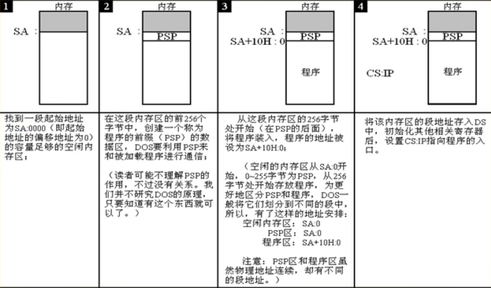

#### EXE文件中的程序的加载过程总结

- 程序加载后, ds中存放着程序所在内存区的段地址, 这个内存区的偏移地址为0, 则程序所在的内存区的地址为: `ds:0`;
- 这个内存区的前256个字节中存放的是PSP, dos用来和程序进行通信
- 从256字节处向后的空间存放的是程序
- 所以, 我们从ds中可上以得到PSP的段地址SA, PSP的偏移地址为0, 则物理地址为
SAX16+0
- 因为PSP占256(100H)字节, 所以程序的物理地址是:  
$SA \times 16 + 0 + 256 = SA \times 16 + 16 \times 16 = (SA + 16) \times 16 + 0$

#### debug int 21H

`int 21H` 需要使用 p 命令执行, 显示 Program terminated normally, 否则CS:IP会跳到别的地方

## [bx]和内存单元

`[0]` 这种写法只在 debug 中有效, 在实际编写中需要使用这几种: `[bx]`、`ds:[0]`、`ds:[bx]`, 其中 bx 为通用寄存器, ds 为数据段寄存器

例如:  
`mov ax, [bx]` 将偏移地址为bx的内存单元的值送入寄存器ax  
`mov [bx], ax` 将寄存器ax的值送入偏移地址为bx的内存单元  
`mov ax, ds:[0]` 将偏移地址为0的内存单元的值送入寄存器ax  
`mov ds:[0], ax` 将寄存器ax的值送入偏移地址为0的内存单元

### 描述性符号'()'

(x) 表示一个内存地址或寄存器的内容

### 约定符号 idata

约定符号 idata 表示常量

### loop 指令

指令的格式是: `loop 标号`, CPU执行loop指令的时候, 要进行两步操作:

1. (cx) = (cx) - 1
2. 判断cx中的值, 不为零则转至标号处执行程序, 如果为零则向下执行

通常我们用 `loop` 指令来实现循环功能, cx中存放循环次数

计算2的12次方示例:

```text
assume cs:code

code segment
start:
    mov ax,2
    mov cx,11
s:
    add ax,ax
    loop s

    mov ax,4c00H
    int 21H
code ends

end start
```

在编译器编译时会自动将标号转换为偏移地址

### 赋值

指的是让寄存器中的数据的值和内存单元中的数据的值相等

### 段前缀

出现在访问内存单元的指令中, 用于显示地指明内存单元的段地址, 称为段前缀

例如 `mov ax, [bx]`, 此时的段前缀为ds:, 即访问内存单元 ds:bx  
例如 `mov ax, cs:[bx]`, 此时段前缀为cs:, 即访问内存单元 cs:bx  
在不指定段前缀时, `[bx]` 的默认段前缀是ds:

### 一段安全的空间

在写入内存时应该考虑这段内存是否是安全的, 这段内存不应存放着系统或其它程序的数据和代码

一般的PC机中, DOS方式下, DOS和其他合法的程序一般都不会使用0:200~0:2FF的256个字节的空间, 所以, 我们使用这段空间是安全的

## 包含多个段的程序

### 在代码段中使用数据 (dw、db)

`dw`: 定义字型数据, 即 define word  
`db`: 定义字节数据, 即 define byte

dw示例:

```text
assume cs:code

code segment
    dw 0123H, 0456H, 0789H, 0abcH  ;写入多个字型数据
start:  ;此处start标号为实际要执行的指令的位置, 如果标号在dw上面, 会把dw写入的数据也翻译成代码执行
    mov ax, 0
    mov bx, 0
    mov cx, 4
s:
    add ax, cs:[bx]
    add bx, 2
    loop s
    mov ax, 4c00H
    int 21H
code ends

end start  ;结束代码并告诉编译器程序入口在标号start处
```

### 在代码段中使用栈

示例:

```text
assume cs:code

code segment
    dw 0123H, 0456H, 0789H, 0abcH, 0defH, 0fedH, 0cbaH, 0987H  ;数据
    dw 0, 0, 0, 0, 0, 0, 0, 0  ;作为栈的空间
start:
    mov ax, cs
    mov ss, ax
    mov sp, 32  ;设置栈顶元素ss:sp指向cs:32

    mov bx, 0
    mov cx, 8
s:
    push cs:[bx]
    add bx, 2
    loop s

    mov bx, 0
    mov cx, 8
sa:
    pop cs:[bx]
    add bx, 2
    loop sa

    mov ax, 4c00H
    int 21H
code ends

end start
```

### end 的作用

end 除了通知编译器程序结束外, 还可以通知编译器程序的入口在什么地方

### 将数据、代码、栈放入不同的段

用和定义代码段一样的方法来定义多个段, 然后在这些段里面定义需要的数据, 或通过定义数据来取得栈空间

示例:

```text
assume cs:code, ds:data, ss:stack

code segment
start:
    mov ax, stack
    mov ss, ax
    mov sp, 16
    mov ax, data
    mov ds, ax

    mov bx, 0
    mov cx, 8
s:
    push [bx]
    add bx, 2
    loop s

    mov bx, 0
    mov cx, 8
sa:
    pop [bx]
    add bx, 2
    loop sa

    mov ax, 4c00H
    int 21H
code ends

stack segment
    dw 0, 0, 0, 0, 0, 0, 0, 0
stack ends

data segment
    dw 0123H, 0456H, 0789H, 0abcH, 0defH, 0fedH, 0cbaH, 0987H
data ends

end start
```

### assume 的作用

`assume cs:code, ds:data, ss:stack` 是给编译器看的, 但编译器并不会将其关联的地址给段寄存器, 实际关联代码的位置在代码段中

### 段的顺序

编写代码时段的顺序会影响程序加载到内存时各个段的地址, 在内存中的存续为段在代码中定义的顺序

## 更灵活定位内存地址

### and 和 or 指令

#### and

与操作, 可用来将特定比特位设为0

示例:

```text
and al, 00110101B  ;al寄存器和00110101B相与
```

#### or

或操作, 可用来将特定比特位设为1

```text
or al, 00110101B  ;al寄存器和00110101B相或
```

### 关于 ASCII 码

ASCII是一套编码方案, 所谓编码方案, 就是一套规则, 它约定了用什么样的信息来表示显示对象, 比如用 0001 代表中国, 用 0002 代表美国

### 以字符形式给出的数据

在汇编程序中, 用 `'......'` 的方式指明数据是以字符的形式给出的, 编译器将把它们转化为相应的ASCII码

例如:  
`db 'unIX'`, 相当于 `db 75H, 6EH, 49H, 58H`, 'u'、'n'、'I'、'X'的ASCII码分别为75H、6EH、49H、48H  
`mov al, 'a'`, 相当于 `mov al, 61H`, 'a'的ASCII码为61H

### 大小写字母转换的问题

大写字母A的ASCII码为40H, 小写字母a的ASCII码为60H, 它们之间相差20H  
大写字母和小写字母的ASCII码的二进制区别只在于第五位, 小写字母为1大写字母为0

大小写转换示例:

```text
assume cs:code, ds:data

code segment
start:
    mov ax, data
    mov ds, ax
    mov bx, 0
    mov cx, 11
s:
    mov al, [bx]
    and al, 11011111B  ;通过与操作转大写字母
    or al, 00100000B  ;通过或操作转小写字母
    mov [bx], al
    inc bx
    loop s

    mov ax, 4c00H
    int 21H
code ends

data segment
    db 'Hello World'
data ends

end start
```

### [bx+idata]

例如 `mov ax, [bx+200]`: 将偏移地址为bx+200的内存单元的数据送入寄存器ax

`mov ax, [bx+200]` 也可以写成以下形式:

- `mov ax, [200+bx]`
- `mov ax, 200[bx]`
- `mov ax, [bx].200`

C语言和汇编定位字符对比:  
C: `a[i]`, `b[i]`  
汇编: `0[bx]`, `5[bx]`  
[bx+idata] 为高级编程语言实现数组提供了便利

### SI 和 DI

SI和DI是8086CPU中和bx功能相近的寄存器, 但是SI和DI不能够分成两个8位寄存器来使用

### [bx+si]

类似于 `[bx+si]` 的形式也可以写成 `[bx][si]`

### [bx+si+idata]

(bx)+(si)+(idata)

### 嵌套 loop 需要注意的点

loop和cx是绑定一起的, 定义内存循环时必定会将外层循环的cx覆盖掉, 造成死循环, 所以需要在进入内层循环前将外层循环的cx值取出, 在内存循环结束时取回cx的值, 有多种方法可以实现, 比如用额外的寄存器临时存放, 临时写入内存, 但最推荐使用栈

## 数据处理的两个基本问题

### 描述性符号 reg、sreg

用 reg 表示寄存器, 用 sreg 表示段寄存器

### bx、si、di、bp

总结:

1. 在8086CPU中, 只有这四个寄存器(bx、bp、si、di)可以用在 `[...]` 中来进行内存单元的寻址
2. 在 `[...]` 中, 这四个寄存器(bx、bp、si、di)可以单个出现, 或只能以四种组合出现: bx和si、bx和di、bp和si、bp和di
3. 只要在 `[...]` 中使用寄存器bp, 而指令中没有显性的给出段地址, 段地址就默认在ss中

bp (base pointer), 基址指针, 用来给栈提供栈的相对基址寻址

### 机器指令处理的数据所在位置

绝大部分机器指令都是进行数据处理的指令, 处理大致可分为三类: 读取、写入、运算

指令在执行前, 所要处理的数据可以在三个地方:  
CPU内部、内存、端口

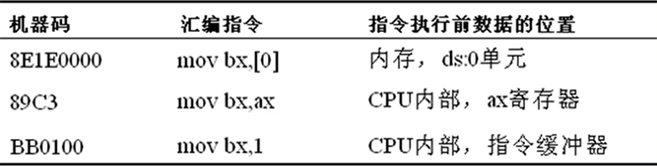

汇编语言用三个概念来表达数据的位置

1. 立即数 (idata)

   对于直接包含在机器指令中的数据 (执行前在 CPU 的指令缓冲器中), 在汇编语言中称为立即数, 在汇编指令中直接给出

2. 寄存器

   指令要处理的数据在寄存器中, 在汇编指令中给出相应的寄存器名

3. 段地址 (SA) 和偏移地址 (EA)

   指令要处理的数据在内存中, 在汇编指令中可用[X]的格式给出EA, SA在某个段寄存器中

   - 存放段地址的寄存器可以是默认的
   - 存放段地址的寄存器也可以显性的给出

### 寻址方式

当数据存放在内存中的时候, 我门可以用多种方式来给定这个内存单元的偏移地址, 这种定位内存单元的方法一般被称为寻址方式

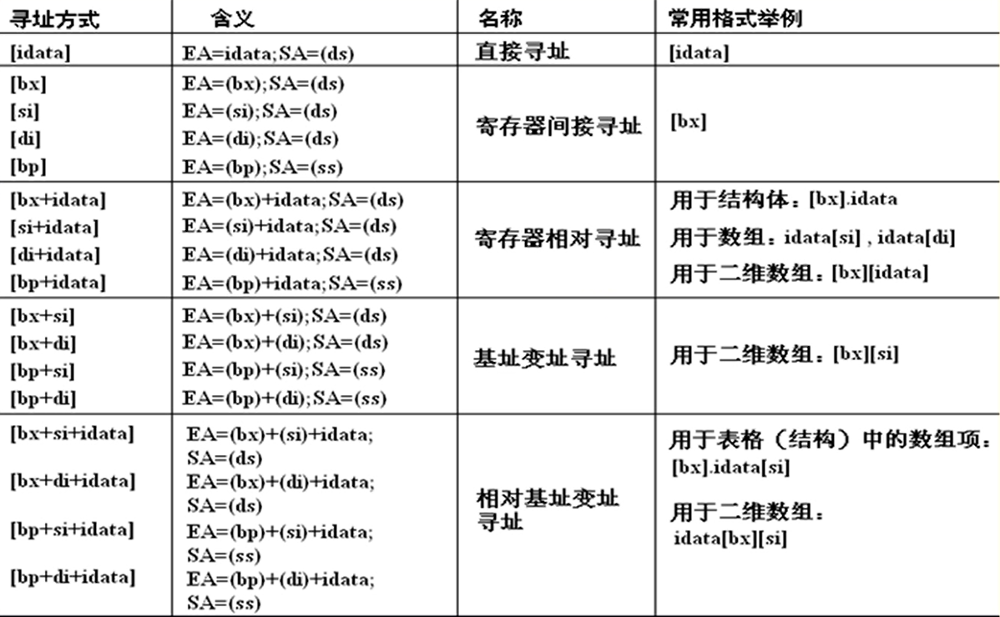

### 指令要处理的数据有多长

8086CPU的指令, 可以处理两种尺寸的数据, byte和word。所以在机器指令中要指明, 指令进行的是字操作还是字节操作

### X ptr

用 `word ptr` 指明指令访问的内存单元是一个字单元
用 `byte ptr` 指明指令访问的内存单元是一个字节单元

示例:

- `mov word ptr ds:[0], 1`
- `inc word ptr [bx]`
- `inc byte ptr ds:[0]`
- `add byte ptr [bx], 2`

在没有寄存器参与的内存单元访问指令中, 用word ptr或byte ptr显性地指明所要访问的内存单元的长度是很必要的

### 寻址方式综合

8086CPU提供的如 `[bx+si+idata]` 的寻址方式为结构化数据的处理提供了方便  
一般来说, 我们可以用 `[bx+idata+si]` 的方式来访问结构体中的数据  
用bx定位整个结构体, 用 `idata` 定位结构体中的某一个数据项, 用 `si` 定位数组项中的每个元素  
为此, 汇编语言提供了更为贴切)的书写方式  
如: `[bx].idata`、`[bx].idata[si]`

### div 指令

除法指令(division), 使用div作除法的时候:

- 除数: 8位或16位, 在寄存器或内存单元中
- 被除数: (默认)放在AX或DX和AX中

| 除数 | 被除数 |
| --- | --- |
| 8位 | 16位(AX) |
| 16位 | 32位(DX+AX) |

计算结果存放位置:

| 运算 | 8位 | 16位 |
| --- | --- | --- |
| 商 | AL | AX |
| 余数 | AH | DX |

div 指令格式:

- `div reg`
- `div 内存单元`

示例:

1. 利用除法指令计算100001/100:

   ```text
   mov dx, 1
   mov ax, 86A1H
   mov bx, 100
   div bx
   ```

   程序执行后, (ax)=03E8H (即1000), (dx)=1 (余数位1)

2. 利用除法指令计算1001/100

   ```text
   mov ax, 1001
   mov bl, 100
   div bl
   ```

   程序执行后, (al)=0AH (即10), (ah)=1 (余数为1)

### 伪指令 dd

和 `dw`、`db` 类似, `dd` 是用来定义 dword (double word双字) 型数据的

示例:

```text
data segment
    db 1  ;数据为01H, 在data:0处, 占1个字节
    dw 1  ;数据为0001H, 在data:1处, 占1个字
    dd 1  ;数据为00000001H, 在data:3处, 占2个字
data ends
```

### dup

dup是一个操作符, 在汇编语言中同db、dw、dd等一样, 也是由编译器识别处理的符号  
它是和db、dw、dd等数据定义伪指令配合使用的, 用来进行数据的重复

示例:

- `db 3 dup (0)`

  定义了3个字节, 它们的值都是0, 相当于 `db 0, 0, 0`

- `db 3 dup (0, 1, 2)`

  定义了9个字节, 它们是  
  0、1、2、0、1、2、0、1、2  
  相当于 `db 0, 1, 2, 0, 1, 2, 0, 1, 2`

由示例可知 dup 使用格式:  
`db 重复次数 dup (重复的字节数据)`  
`dw 重复次数 dup (重复的字数据)`  
`dd 重复次数 dup (重复的双字数据)`

## 寻址方式在结构化数据访问中的应用

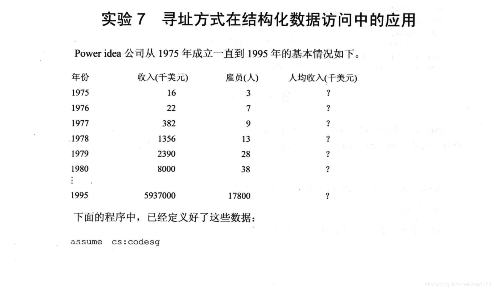  
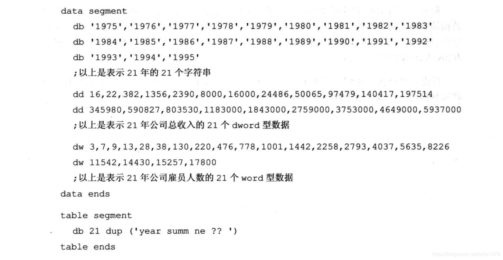  
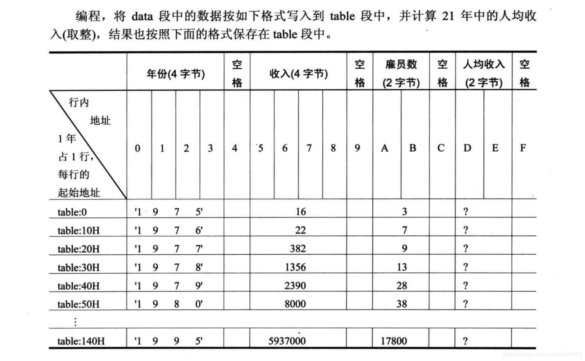  
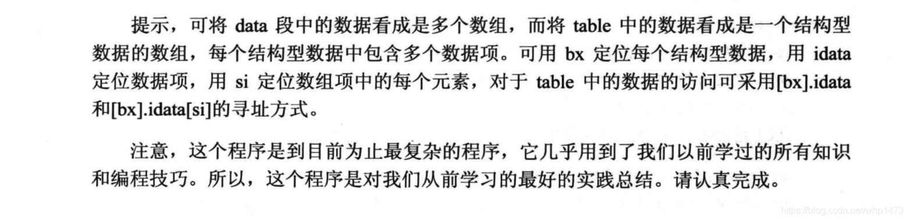

将数据按照table段中的格式写入table段, 计算人均收入, 将人均收入一并写入table段中

```text
assume cs:code, ds:data

data segment
    db '1975', '1976', '1977', '1978', '1979', '1980', '1981', '1982', '1983'
    db '1984', '1985', '1986', '1987', '1988', '1989', '1990', '1991', '1992'
    db '1993', '1994', '1995'
    ;地址范围: 0H - 53H

    dd 16, 22, 382, 1356, 2390, 800, 16000, 24486, 50065, 97479, 140417, 197514
    dd 345980, 590827, 803530, 1183000, 1843000, 2759000, 3753000, 4649000, 5937000
    ;地址范围: 54H - 0A7H

    dw 3, 7, 9, 13, 28, 38, 130, 220, 476, 778, 1001, 1442, 2258, 2793, 4037, 5635, 8226
    dw 11542, 14430, 15257, 17800
    ;地址范围: 0A8H - 0D1H
data ends

table segment
    db 21 dup ('year summ ne ?? ')
table ends

code segment
start:
    mov ax, data
    mov ds, ax
    mov ax, table
    mov es, ax
    mov bx, 0
    mov si, 0A8H
    mov di, 0
    mov cx, 21
    ;初始化
s:
    mov ax, [bx]
    mov dx, [bx+2]
    mov es:[di], ax
    mov es:[di+2], dx
    ;以上把年份写入table
    mov ax, 54H[bx]
    mov dx, 54H[bx+2]
    mov es:5H[di], ax
    mov es:5H[di+2], dx
    ;以上把收入写入table
    mov ax, [si]
    mov es:aH[di], ax
    ;以上把雇员数写入table
    mov ax, es:5H[di]
    mov dx, es:5H[di+2]
    div word ptr es:aH[di]
    mov es:dH[di], ax
    ;以上计算人均收入并写入table
    add bx, 4
    add si, 2
    add di, 16
    loop s

    mov ax, 4c00H
    int 21H
code ends

end start
```

## 转移指令的原理

8086CPU的转移指令分为以下几类

- 无条件转移指令 (如: jmp)
- 条件转移指令
- 循环指令 (如: loop)
- 过程
- 中断

### 操作符 offset

操作符 offset 在汇编语言中是由编译器处理的符号, 它的功能是取得标号的偏移地址  
比如下面的程序:

```text
assume cs:codesg

codesg segment
start:
    mov ax, offset start ;相当于mov ax, 0
s:
    mov ax, offset s     ;相当于mov ax, 3
codesg ends

end start
```

### jmp 指令

- jmp 为无条件转移, 可以只修改 IP, 也可以同时修改 CS 和 IP
- jmp 指令要给出两种信息:
  - 转移的目的地
  - 转移的距离 (段间转移、段内短转移, 段内近转移)

#### 依据位移进行转移的 jmp 指令

`jmp short 标号` (转到标号处执行指令)

这种格式的 jmp 指令实现的是段内短转移, 它对 IP 的修改范围为 -128 ~ 127, 也就是说, 它向前转移时以最多越过 128 个字节, 向后转移可以最多越过 127 个字节。

汇编指令与机器码的对应示例:

| 汇编指令 | 机器指令 |
| --- | --- |
| `mov ax,0123` | `B8 23 01` |
| `mov ax,ds:[0123]` | `A1 23 01` |
| `push ds:[0123]` | `FF 36 23 01` |

可以看到, 在一般的汇编指令中, 汇编指令中的 idata (立即数), 不论它是表示一个数据还是内存单元的偏移地址, 都会在对应的机器指令中出现, 因为CPU执行的是机器指令, 它必项要处理这些数据或地址

假设有如下程序

```text
start:
    mov ax, 0000
    jmp short s
    add ax, 1
s:
    inc ax
```

| 单元地址 | 机器码 | 指令 |
| --- | --- | --- |
| `13FD:0000` | `B80000` | `MOV AX,0000` |
| `13FD:0003` | `E803` | `JMP 0008` |
| `13FD:0005` | `83C001` | `ADD AX,+01` |
| `13FD:0008` | `40` | `INC AX` |

观察 jmp 的机器指令发现 e8 后跟着的是 03 而不是 08, 而 jmp 与 s 标号之间的指令所占空间刚好是 3 个字节  
这说明在机器指令中并不包含转移的目的地址
如果机器指令中不包含目的地址的话, 那么就是说 **CPU 不需要这个目的地址就可以实现对 IP 的修改**

CPU 执行到 `jmp short s` 指令时, 读取指令到指令缓冲器, 将 CS:IP 指向下一个指令, 执行指令缓冲区的内容修改IP

### jmp near ptr 标号

`jmp near ptr 标号` 实现段内近转移  
功能为: (IP)=(IP)+16位位移
能够表示的范围: -32768 ~ 32767

### jmp far ptr 标号

`jmp far ptr 标号` 实现段段间转移, 又称远转移  
far ptr 指明了指令用标号的段地址和偏移地址修改 CS 和 IP

### 转移地址在寄存器中的 jmp 指令

`jmp 16位寄存器`

### jmp 内存单元地址

1. `jmp word ptr 内存单元地址` (段内转移)

   功能: 从内存单元地址处开始存放着一个字, 是转移的目的偏移地址

2. `jmp dword ptr 内存单元地址` (段间转移)

    从内存单元地址处开始存放着两个字, 高地址处是字的目的段地址, 低地址处是转移的偏移地址

### jcxz 指令

jcxz 指令位有条件转移指令, 所有的有条件跳转指令都是短转移, 对 IP 的修改范围都为 -128 ~ 127

指令格式: `jcxz 标号` (如果 (cx)=0, 则转移到标号处执行, 也就是为 0 时跳转)

### loop 指令原理

有条件跳转指令, 不为 0 时跳转

### 编译器对转移位移超界的检测

编译器对超界行为进行报错提醒  
注意: `jmp 2000:0100` 的转移指令, 是在 Debug 中使用的汇编指令, 汇编编译器并不认识, 如果在源程序中使用, 编译时也会报错

## 80x25彩色字符模式

在 80×25 彩色字符模式下, 显示器可以显示25行, 每行 80 个字符, 每个字符可以有 256 种属性 (背景色、前景色、闪烁、高亮等组合信息)  
一个字符在显示缓冲区中要占两个字节, 分别从存放字符的 ASCII 码和属性, 80x25 模式下, 一屏的内容在显示缓冲区中共占 4000 个字节  
B8000H ~ BFFFFH 共 32KB 的空间, 为 80x25 彩色字符模式的显示缓冲区

属性字节的格式:

| 7 | 6 | 5 | 4 | 3 | 2 | 1 | 0 |
| --- | --- | --- | --- | --- | --- | --- | --- |
| BL | R | G | B | I | R | G | B |
| 闪烁 | 背景 红 | 绿 | 蓝 | 高亮 | 前景 红 | 绿 | 蓝 |

## call 和 ret 指令

### ret 和 retf

1. ret 指令用栈中的数据, 修改 IP 的内容, 从而实现近转移。出栈一次, 赋给 IP
2. retf 指令用栈中的数据, 修改 CS 和 IP 的内容, 从而实现远转移。出栈两次, 依次赋给 IP、CS

语法:

```text
ret
```

### call 指令

call 指令经常跟 ret 指令配合使用, 因此 CPU 执行 call 指令, 先将当前的 IP 或 CS 和 IP 压入栈中, 再转移 (jmp)  
call 指令不能实现短转移, 除此之外, call 指令实现转移的方法和 jmp 指令的原理相同

实现近转移, 语法:

```text
call 标号
```

#### call far ptr 标号

段间转移, 语法:

```text
call far ptr 标号
```

#### 转移地址在寄存器中的 call 指令

指令格式: `call 16位寄存器`

#### 转移地址在内存中的 call 指令

有两种格式:

1. `call word ptr 内存单元地址`
2. `call dword ptr 内存单元地址`

   IP 在低字单元, CS 在高字单元

### mul 指令

mul 是乘法指令, 使用 mul 做乘法时, 相乘的两个数要么都是 8 位, 要么都是 16 位  
两个 8 位计算结果存放在 AX 中, 两个 16 位计算结果存放在 AX (低位) 和 DX (高位) 中  
第一个因数为 ax 或 al, 第二个因数在指令中给出

格式:

```text
mul reg
mul 内存单元
```

### 参数和返回值传递

可以用 bx 寄存器作为参数, 结果可以放在 ax、dx 中, 也可以通过栈实现等

### 显示字符串子程序示例

子程序描述:

- 名称: show_str
- 功能: 在指定的位置, 用指定的颜色, 显示一个用0结束的字符串。
- 参数: (dh)=行号(取值范围 0~24), (dl)=列号(取值范围 0~79), (cl)=颜色, ds:si指向字符串的首地址
- 返回: 无

应用举例: 在屏幕的 8 行 3 列, 用绿色显示 data 段中的字符串

```text
assume cs:code, ds:data

data segment
    db 'hello world',0
data ends

code segment
start:
    mov ax,data
    mov ds,ax
    mov dh,8
    mov dl,3
    mov cl,2
    mov si,0
    call show_str
    mov ax,4c00h
    int 21h

show_str:
    mov ax,0b800h
    mov es,ax
    mov al,160
    mul dh
    mov dh,0
    mov bx,ax
    add bx,dx
    add bx,dx
    mov al,cl
    mov ch,0
show_str_loop:
    mov cl,ds:[si]
    jcxz show_str_loop_end
    mov es:[bx+di],cl
    mov es:[bx+di+1],al
    inc si
    add di,2
    jmp short show_str_loop
show_str_loop_end:
    ret
code ends

end start
```

### 解决除法溢出子程序示例

例如word除以byte 1000/1, 结果的 1000 在al中存不下, 会报 CPU 内部的错误 divide overflow  
利用公式解决除法溢出

给出一个公式:  
X: 被除数, 范围: [0, FFFFFFFF]  
N: 除数, 范围: [0, FFFF]  
H: X 高 16 位, 范围: [0, FFFF]  
L: X 低 16 位, 范围: [0, FFFF]  
int(): 描述性运算符, 取商  
rem(): 描述性运算符, 取余数  
公式: $X / N = int(H / N)*65536 + [rem(H / N)*65536 + L]/N$

```text
assume cs:code, ss:stack

stack segment
    db 10 dup (0)
stack ends

code segment
start:
    mov ax,stack
    mov ss,ax
    mov sp,10h

    mov ax,4240h
    mov dx,0fh
    mov cx,0ah

    call divdw

    mov ax,4c00h
    int 21h

divdw: ;dword/word  参数: ax dx (被除数) cx (除数) 计算结果存放在 ax (低位) dx (高位) cx (商)
    push ax
    mov ax,dx
    mov dx,0
    div cx
    
    mov bx,ax
    pop ax
    div cx
    mov cx,dx
    mov dx,bx
    ret
code ends

end start
```

### 显示数字到屏幕子程序示例

```text
assume cs:code, ss:stack

stack segment
    db 10 dup (0)
stack ends

code segment

start:
    mov ax,stack
    mov ss,ax
    mov sp,10h

    mov ax,520
    call int2str_at_stack
    mov cx,bx
    mov si,0
s:
    pop ax
    mov ds:[si],ax
    inc si
    loop s
    mov byte ptr ds:[si],0

    mov si,0
    mov dx,0803h
    mov cl,2
    call show_str

    mov ax,4c00h
    int 21h

int2str_at_stack: ;转换16位整数为ASCII码, 参数为 ax, 结果存放在栈中, bx 保存字符长度
    mov bx,0
    pop di
int2str_loop:
    inc bx
    mov dx,0
    mov cx,10
    div cx
    add dx,30h
    push dx
    mov cx,ax
    jcxz int2str_loop_end
    jmp short int2str_loop
int2str_loop_end:
    push di
    ret

show_str: ;显示字符串 ds:si 指向字符串, dh 存放行, dl 存放列, cl 存放颜色
    mov ax,0b800h
    mov es,ax
    mov al,160
    mul dh
    mov dh,0
    mov bx,ax
    add bx,dx
    add bx,dx
    mov al,cl
    mov ch,0
show_str_loop:
    mov cl,ds:[si]
    jcxz show_str_loop_end
    mov es:[bx+di],cl
    mov es:[bx+di+1],al
    inc si
    add di,2
    jmp short show_str_loop
show_str_loop_end:
    ret

code ends

end start
```

## 标志寄存器

8086CPU的标志寄存器有16位, 其中存储的信息通常被称为程序状态字 (PSW)

8086CPU的flag寄存器的结构:

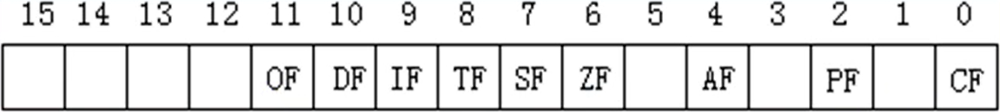

第 1, 3, 5, 12, 13, 14, 15 位没有任何意义  
第 0, 2, 4, 6, 7, 8, 9, 10, 11 位具有特殊意义

### ZF 标志

flag的第6位是ZF, 零标志位  
它记录相关指令执行后  
结果为0, ZF=1  
结果为1, ZF=0

示例:

```text
mov ax,1
sub ax
;结果为0, ZF为1
mov ax,2
sub ax
;结果为1, ZF为0
```

在8086CPU的指令集中, 有的指令的执行是影响标志寄存器的, 比如: and、sub、mul、div、inc、or、and 等, 它们大都是运算指令 (进行逻辑或算数运算)  
有的指令的执行对标志寄存器没有影响, 比如: mov、push、pop 等, 它们大都是传送指令

### PF 标志

flag的第2位是PF, 奇偶标志位  
它记录指令执行后, 结果的所有二进制位中1的个数
为偶数, PF=1
为奇数, PF=0

示例:

```text
mov al,1
add al,10
;执行后, 结果为00001011B, 其中有3 (奇数) 个1, 则PF=0

mov al,1
or al,10B
;执行后, 结果为00000011B, 其中有2 (偶数) 个1, 则PF=1
```

### SF 标志

flag的第7位是SF, 符号标志位  
它记录指令执行后  
结果为负, SF=1  
结果为正, SF=0

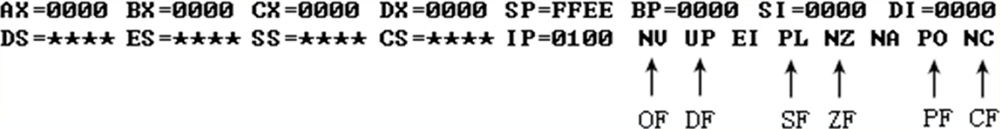
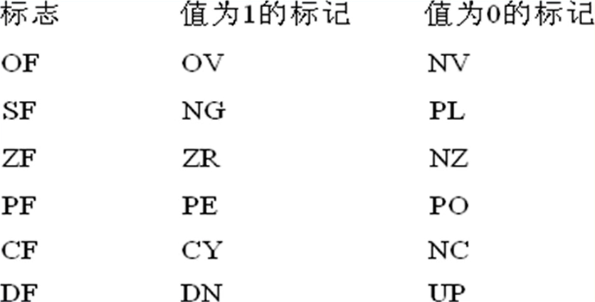

### CF 标志

flag的第0位是CF, 进位标志位

一般情况下, 在进行无符号数运算的时候, 它记录了运算结果的最高有效位向更高位的进位值, 或从更高位的借位值  
对于位数为N的无符号数来说, 其对应的二进制信息的最高位, 即第N-1位, 的最高有效位, 而假想存在的第N位, 就是相于最高有效位的更高位

也可记录借位, 比如两个8位数据: 97H-98H, 将产生借位, 借位后, 相当于计算197H-98H  
而flag的CF位也可以用来记录这个借位值

inc、dec 不会影响 CF 标志

### OF 标志

在进行有符号数运算的时候, 如结果超过了机器所能表示的范围称为溢出  
(8位有符号寄存器的标识范围 -128~127)

注意, 这里所讲的溢出, 只是对于有符号数运算而言 (就像进位只是相对于无符号数而言)

### adc 指令

adc是带进位加法指令, 它利用了CF位上记录的进位值

格式: `adc 操作对象1,操作对象2`  
功能: 操作对象1=操作对象1+操作对象2+CF  
比如: `adc ax,bx` 实现的功能是: (ax)=(ax)+(bx)+CF

示例:

```text
mov ax,2
mov bx,1
sub bx,ax
adc ax,1
;执行后, (ax)=4
```

### cmp 指令

格式: `cmp 操作对象1,操作对象2`  
功能: 计算操作对象1-操作对象2 但并不保存结果, 仅仅根据计算结果对标志寄存器进行设置

如果对有符号位的数进行比较需要考虑到溢出问题, 即不仅仅看 SF 的值也要看 OF 的值

### 检测比较结果的条件转移指令

条件转移指令小结

| 指令 | 含义 | 检测的相关标志位 |
| --- | --- | --- |
| `je` | 等于则转移 | ZF=1 |
| `jne` | 不等于则转移 | ZF=0 |
| `jb` | 低于则转移 | CF=1 |
| `jnb` | 不低于则转移 | CF=0 |
| `ja` | 高于则转移 | CF=0, ZF=0 |
| `jna` | 不高于则转移 | CF=1 或 ZF=1 |

它们所检测的标志位, 都是cmp指令进行无符号数比较时候, 记录比较结果的标志位

### DF 标志和串传送指令

flag的第10位是DF, 方向标志位  
在串处理指令中, 控制被刺操作后si, di的增减

DF=0: 每次操作后si, di递增
DF=1: 每次操作后si, di递减

#### movsb

格式1: `movsb`  
功能: (以字节为单位传送)

1. ((es)×16 + (di)) = ((ds)×16 + (si))
2. 如果 DF=0 则:  
   (si) = (si) + 1  
   (di) = (di) + 1  
   如果 DF=1 则:  
   (si) = (si) - 1  
   (di) = (di) - 1

movsb 的功能是将 ds:si 指向的内存单元中的字节送入 es:di 中, 然后根据标志寄存器 DF 位的值, 将 si 和 di 递增或递减  
当然, 也可以传送一个字: `movsw`

#### movsw

格式2: `movsw`  
功能: (以字为单位传送)  
将 ds:si 指向的内存字单元中 word 送入 es:di 中, 然后根据标志寄存器 DF 位的值, 将 si 和 di 递增2或递减2

#### rep

movsb 和 movsw 进行的是串传送操作中的一个步骤, 一般来说 movsb 和 movsw 都和 rep 配合使用, 格式如下: `rep movsb`  
rep 的作用是根据 cx 的值, 重复执行后面的串传送指令

由于每执行一次 movsb 指令 si 和 di 都会递增或递减指向后一个单元或前个单元, 则 `rep movsb` 就可以循环实现(x)个字符的传送

#### cld 指令和 std 指令

8086CPU提供下而两条指令对DF位进行设置:  
`cld` 指令: 将标志寄存器的DF位置0  
`std` 指令: 将标志寄存器的DF位置1

### pushf 和 popf

`pushf`: 将标志寄存器的值压栈  
`popf`: 从栈中弹出数据, 送入标志寄存器中

pushf 和 popf, 位直接访问标志寄存器提供了一种方法

## 需要注意的点

- 在汇编源程序中, 数据不能以字母开头, 所以字母开头的值要在前面加0 (`ffffh` -> `0ffffh`)
- 进行加法计算时需要注意类型, 比如一个16位的寄存器和8位的内存相加会发生越界问题, 可以用新的寄存器存放8位数据再相加解决
- 8086PC机一个段总是16的倍数

## 指令大全

汇编指令执行顺序为从右到左, 如: `mov ax,1024`, 表示将 `ax` 寄存器的值改为 `1024` (和高级编程语言的赋值顺序一致)  
当数值以 `H` 结尾时表示这是一个 16 进制数  
汇编指令不区分大小写

| 指令 | 描述 | 示例 | 示例描述 |
| --- | --- | --- | --- |
| `mov` | 传送指令 (赋值), 更改寄存器的值 | `mov ax,1024H` | 把 `ax` 寄存器的值赋为 `1024H` |
| `jmp` | 转移指令, 修改 `CS, IP` 的值 | `jmp 2AE3:3` | 将 `CS, IP` 的值分别修改为 `2AE3, 3` |
| `add` | 增加 | `add ax,1024H` | 将 `ax` 寄存器的值加上 `1024H` |
| `sub` | 减少 | `sub ax,1024H` | 将 `ax` 寄存器的值减去 `1024H` |
| `push` | 将一个寄存器中的数据入栈 | `push ax` | 将 `ax` 的值送入栈顶 |
| `pop` | 出栈, 用一个寄存器接收出栈的数据 | `pop ax` | 弹出栈顶的值给 `ax` |
| `inc` | 自增指令, 自增1 | `inc ax` | ax寄存器自增1 |
| `dec` | 自减指令, 自减1 | `dec ax` | ax寄存器自减1 |
| `loop` | 循环指令 | `loop s` | 循环cx次, cx不为0则跳转到标号s处 |
| `and` | 与 | `and al, 00110101B` | `al` 寄存器和 `00110101B` 相与 |
| `or` | 或 | `or al, 00110101B` | `al` 寄存器和 `00110101B` 相或 |
| `ptr` | 指明数据大小 | `mov word ptr [bx], 1` | 指明了要写入的是字型数据 |
| `div` | 除法 | `div byte ptr ds:[0]` | 求出 `ds:[0]` 的商和余数 |
| `mul` | 乘法 | `mul bl` | `al` 和 `bl` 相乘, 计算结果放到 `ax` 中 |
| `adc` | 增加 (带 CF 的值) | `adc ax,1` | `ax` 加上 1 和 CF |
| `sbb` | 减少 (带 CF 的值) | `abb ax,1` | `ax` 减去 1 和 CF |
| `cmp` | 比较, 仅影响 flag 相关各位 | `cmp ax,ax` | (ax)-(ax), ZF=1 |
| `je` |  |  |  |
| `jne` |  |  |  |
| `jb` |  |  |  |
| `jnb` |  |  |  |
| `ja` |  |  |  |
| `jna` |  |  |  |
| `movsb` |  |  |  |
| `movsw` |  |  |  |
| `rep` |  |  |  |
| `cld` |  |  |  |
| `std` |  |  |  |
| `pushf` |  |  |  |
| `popf` |  |  |  |
| **伪指令** |  |  |  |
| `dw` | 定义字型数据 (define word) | `dw 0123H, 0456H` | 定义了两个字单元的二进制数据 |
| `db` | 定义字节数据 (define byte) | `dw 34H, 12H` | 定义了两个字节单元的二进制数据 |
| `dd` | 定义双字型数据 (define dword) | `dd 01H` | 定义了一个双字单元的二进制数据 |
| `nop` | 占用一个字节, 不执行操作 | `nop` | 占用一个字节 |

## CPU 加法计算原理

半加器可完成一个位的计算, 多个全加器可完成多个位计算

半加器:

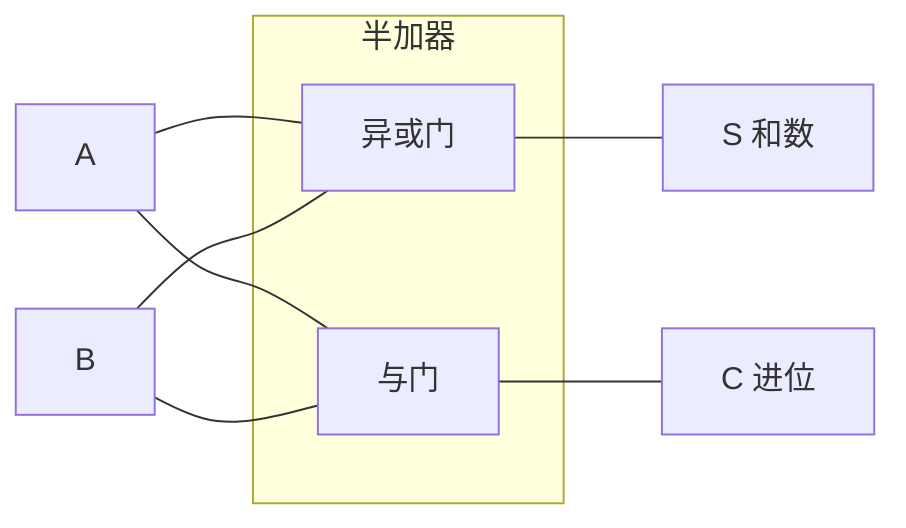

全加器:

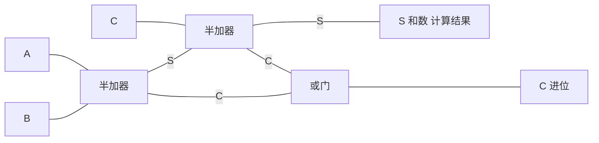

C 为上一个全加器的进位, 如果此全加器为第一个全加器则 C 为 0
