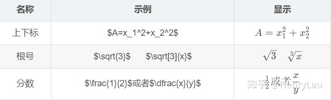
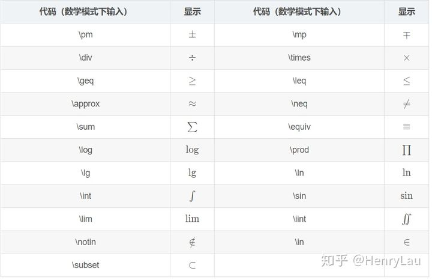
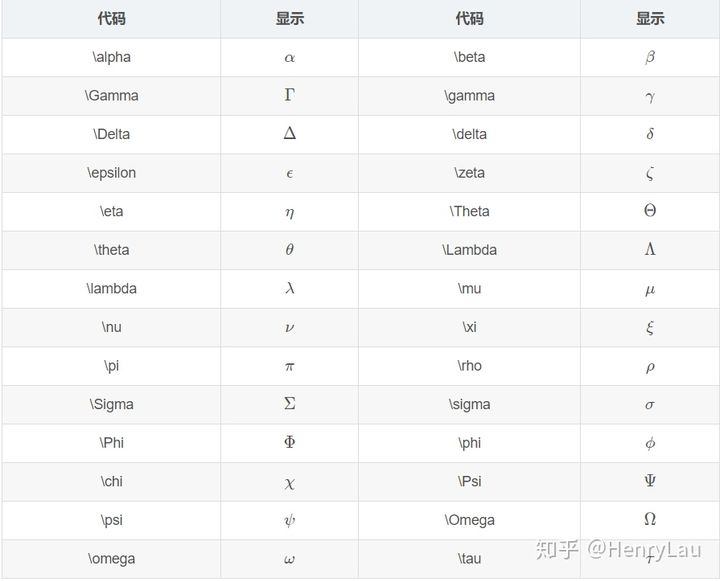
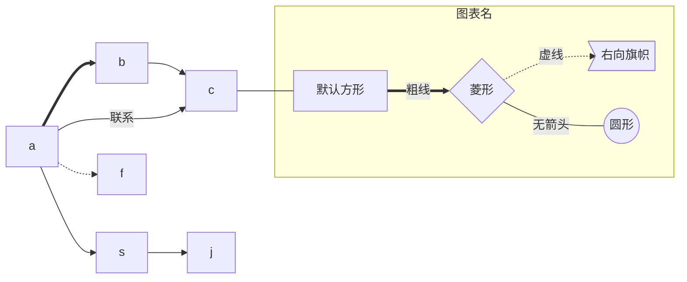
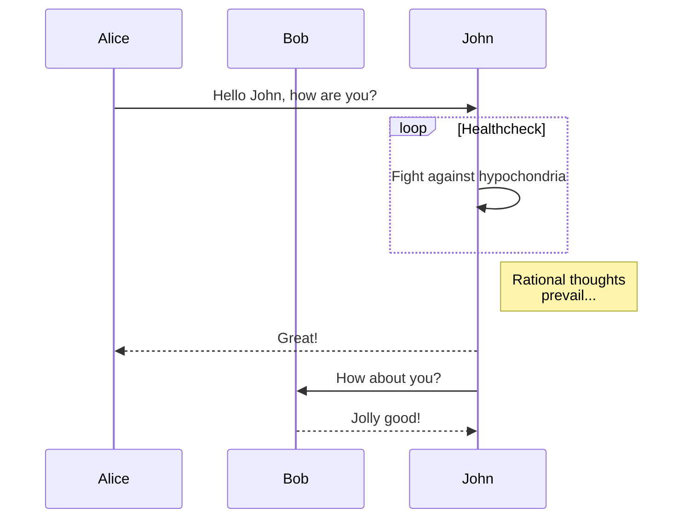
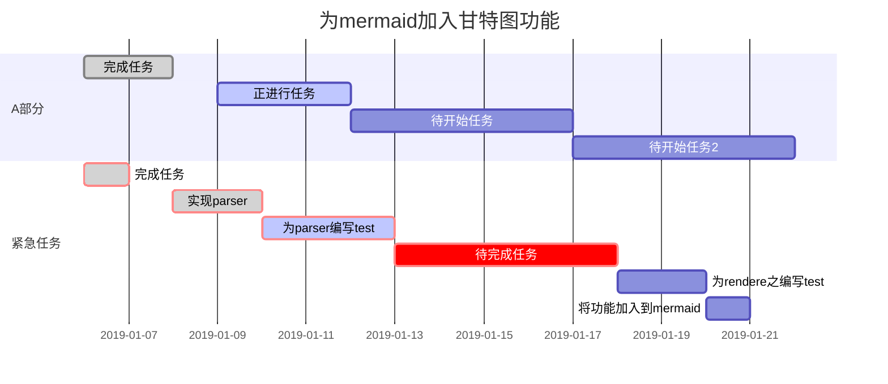

# Markdown

## 前言

Markdown 是 HTML 的子集, 拥有很好的沉浸式体验, 也可以直接编写原生 html  
Markdown 编辑器将 Markdown 文件翻译为 html 文件通过浏览器显示

## 常用语法

> [!INFO]
> 通过效果和源码对比学习  
> **注意: 一些语法需要编辑器中打开对应的选项, 或编辑器不支持**

> [!NOTE]
> 标题
>
> # 一级标题
>
> ## 二级标题
>
> ### 三级标题
>
> #### 四级标题
>
> ##### 五级标题
>
> ###### 六级标题

- 无序号列表, 除了星号 (\*) 也可以使用加号 (+) 和减号 (-)
- 列表项2

1. 有序号列表
2. 列表项2
3. 列表可以嵌套使用
   - 列表项1
   - 列表项2

> 段落引用  
> 段落引用
>
> > 段落引用
> >
> > > 段落引用

**加粗**

_斜体_

~~删除线~~

==高亮==

---

分割线

`行内代码块`  
`a = b`

```python
# 代码块
a = 1
b = 2
a, b = b, a
```

| 表格            | 左对齐          |    居中对齐     |          右对齐 |
| --------------- | :-------------- | :-------------: | --------------: |
| 内容            | 内容            |      内容       |            内容 |
| abcdefg hijklmn | abcdefg hijklmn | abcdefg hijklmn | abcdefg hijklmn |

## 链接

[跳转至标题前言处](#前言)

[跳转至其它文件](Markdown.md)


## Badge

[](https://shields.io/)

## 警告框

> [!INFO]
> Info

> [!INFO]hello
> Info

> [!ABSTRACT]
> Abstract

> [!TIP]
> Tip

> [!QUESTION]
> Question

> [!SUCCESS]
> Success

> [!WARNING]
> Warning

> [!FAILURE]
> Failure

> [!ERROR]
> Error

> [!DANGER]
> Danger

> [!BUG]
> Bug

> [!EXAMPLE]
> Admonition扩展语法关键词包括：
> Note，Abstract，Info，Tip，Success，Question，Warning，Failure，Danger，Bug，Example，Quote

> [!QUOTE]
> Jeff Atwood: 一切能被JavaScript实现的终将会被JavaScript实现。

## Details

<details>
    <summary>黑科技</summary>
    黑科技三闾大夫
</details>

## 数学公式

数学公式: $x + y$

行间数学公式:

$$
x + y
$$

## 块和换行

markdown 将连在一起的两行或多行内容当作一个块, 块内文本在一些编辑器中不会换行  
可以使用 `\` 或两个空格换行

默认用空格替代换行符
如果没效果请尝试关闭编辑器的自动折行

使用\
斜杠

使用  
空格

### 常用符号



### 特殊运算符号



### 希腊字母输入



## 流程图

### flow

```flow
flowchat
    st=>start: Start
    sub1=>subroutine: Subroutine
    op=>operation: Your Operation
    cond=>condition: Yes or No?
    e=>end

    st->sub1->op->cond
    cond(yes)->e
    cond(no)->op
```

语法:

> 定义: `id=>样式: 文本`  
> 连接: `id1->id2`, `id1->id2->id3`  
> 指定条件和方向: `id1(yes)->id2`, `id1(right)->id2`, `id1(no, right)->id2`

| 样式        | 描述     |
| ----------- | -------- |
| start       | 开始     |
| end         | 结束     |
| operation   | 操作     |
| condition   | 条件     |
| inputoutput | 输入输出 |
| subroutine  | 子程序   |

### graph



语法:

> 定义, 指定样式和文本: `id1`, `id1[文本]`, `id1{文本}`  
> 连接: `id1-->id2`

### sequenceDiagram



### gantt


