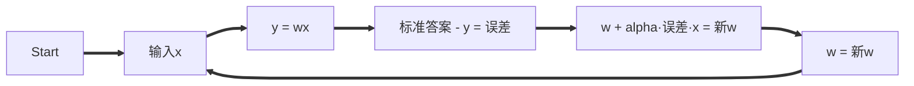

# 人工智能

## McCulloch-Pitts 模型

$$y = \sum_{n=0}^{+\infin} w_nx_n$$
$$y = \sum_{n=0}^{+\infin} w_nx_n + b$$

w为权值, 带入公式得到预测结果y

## Rosenblatt 感知器

让机器自己寻找w值的最优解

alpha参数目的为减小振幅, 取值一般为: 0.05

## 方差代价函数

$$平方误差: e = (y - wx)^2$$
$$开口向上的一元二次函数: e = aw^2 + bw + c$$
$$抛物线顶点值: w = -\frac{b}{2a}$$
$$均方误差: e = \frac{1}{m} \sum_{i=0}^m (x_i^2 * w^2 + (-2x_iy_i) * w + y_i^2)$$
$$均方误差最低点处的w值: w = \frac{\sum_{i=0}^m (x_iy_i)}{\sum_{i=0}^m x_i^2}$$

使用抛物线顶点公式求解的方式就是所谓的正规方程, 这种方式虽好但当数据量大的时候电脑扛不住, 也就有了更常用的方式 **梯度下降**

## 梯度下降

$$w与e的曲线上两点的斜率, 斜率 = \lim_{\Delta{w}\to0} 2aw + a\Delta{w} + b$$
$$当\Delta{w}无穷小时\Delta{w}就会湮灭, 此时斜率为: 斜率(导数) = 2aw + b$$
$$新w = w - 斜率*alhpa$$

导数的另外一种求法

| 函数 | 导数 |
| --- | --- |
| 常函数 | $(c)' = 0$ |
| 幂函数 | $(w^u)' = ux^{u-1}$ |

两个函数的乘法法则: $a*b = (a)'*b + (b)'*a$  
第一个函数的导数乘以第二个函数加第二个函数的导数乘以第一个函数  
两个函数的加法直接相加

$$(e = aw^2 + bw + c)' = 2aw + b + 0 = 2aw + b$$
$$新w = w - \alpha*斜率$$

$\alpha$一般取0.1

## 方差代价函数和梯度下降完整的样子

$$预测结果y = wx + b$$
$$平方误差e = [y - (wx + b)]^2$$
$$w和e的曲线的平方误差: e = x^2w^2 + (2xb - 2xy)w + (y^2 + b^2 - 2by)$$
$$b和e的曲线的平方误差: e = b^2 + (2xw - 2y)b + (x^2w^2 + y^2 - 2xyw)$$

### Logistic 函数

$$\phi(y) = \frac{L}{1 + e^{-k(y-y_0)} }$$
$$取L=1, k=1, y_0=0: \phi(y) = \frac{1}{1+e^-y}$$

